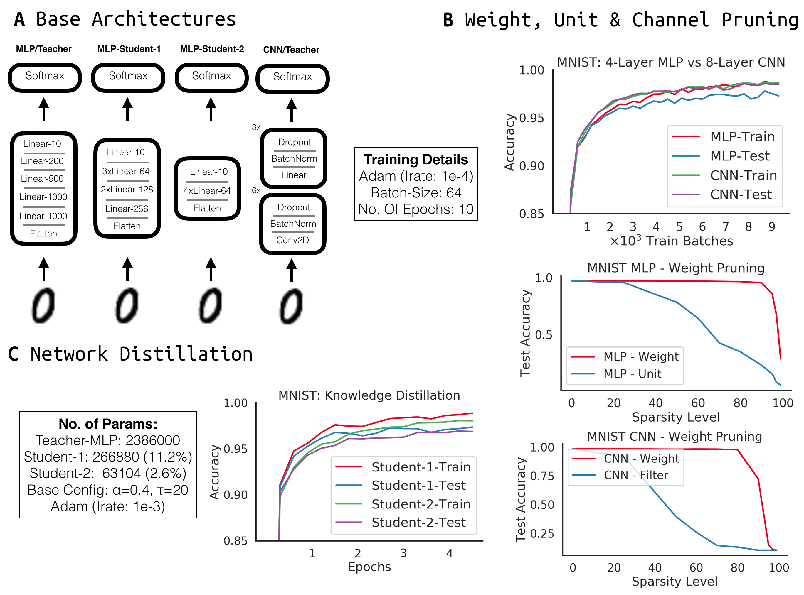

# for.AI - Technical Challenge Submission
## Pruning a Neural Network
## Author: Rob Lange (@RobertTLange)

Hi there :hugs:! In this repo you can find my application to become part of the for.AI research group. The challenge requires to implement a simple ReLU-MLP on MNIST and to perform weight and unit pruning. Additionally I have implemented [knowledge distillation](https://arxiv.org/abs/1503.02531) as well as filter pruning for CNNs. The figure below summarizes the key insights.



This implementation is PyTorch based and can be reproduced by executing the [`prune_playground.ipynb`](prune_playground.ipynb) notebook. First, create a clean virtual environment and pip install the required dependencies. Credits go to [wanglouis49](https://github.com/wanglouis49/pytorch-weights_pruning) and their PyTorch pruning implementation which I adapted.


# Some insights

1. One can prune away quite a lot of weights (up to 99%) and still retain quite good performance (ca. 97% accuracy). This could be due to the high capacity of neural networks and the large degree of overparametrization.
2. These findings also relate to the recent discovery of the 'Lottery Ticket Hypothesis' from Jonathan Frankle. Randomly-initialized, dense neural networks appear to contain a subnetwork that is extremely well initialized. Trained these subnets in isolation can outperform the original full trained network and/or random other subnets. In their approach they make use of iterative magnitude pruning which alternates between pruning and retraining.
3. Weight pruning appears to be more robust than unit/filter pruning. Arguably this is due to the increased freedom of pruning only certain particular weights and not having to prune entire columns/filters.
4. Knowledge distillation provides another alternative to obtain small networks which may be deployed on mobile devices. The use of "dark knowledge" and soft labels allows to use larger learning rates and enables fast training. It would be interesting to look into how one might combine distillation ideas with pruning.

# Structure of the repository:

```
+- prune_playground.ipynb: Notebook that runs the code for the submission.
+- helpers
|  |- body_builder.py: Modular neural network construction
|  |- logger.py: Logger class for training runs
|  |- masked_body_builder.py: Masked neural networks for pruning
|  |- pruning.py: Generate pruning masks (unit, weight, filter)
|  |- train_dojo.py: Training loops for base MNIST and distillation
|  |- utils.py: Plotting, loading in of logs and other mini-helpers
+- configs: .json files that specify experiment setups
+- figures: All the nice plots
+- logs: Training .hdf5 logs
+- networks: Trained network PyTorch checkpoints
+- Readme.md: Project Documentation
+- requirements.txt: list of all required pip packages
```

# Requirements:

* PyTorch, Torchvision, the standard matplotlib, numpy, pandas setup
