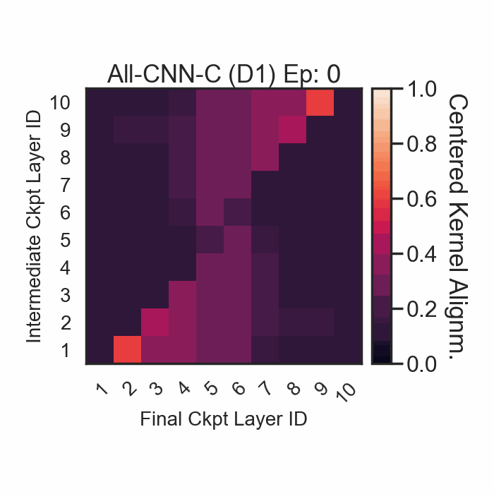

# CKA-RSA on All-CNN-C Networks (CIFAR-10)[](https://colab.research.google.com/github/RobertTLange/code-and-blog/blob/main/10_all_cnn_cka/cka.ipynb)

<a href="linear_depth_1.gif"></a>

In this mini-repo we reproduce some core figures of [Kornblith et al. (2019)](https://arxiv.org/abs/1905.00414) using JAX, flax and optax. More specifically, we train a set of All-CNN-C networks [(Springenberg et al., 2015)](https://arxiv.org/abs/1412.6806) on CIFAR-10 and analyze the resulting representations across layers, checkpoints and different architectures.

The main analysis can be found in [`cka.ipynb`](cka.ipynb) and we provide the flax-based training code as well as the trained checkpoints in a Google Cloud Storage bucket.

The All-CNN-C training protocol includes the following details:

- 350 epochs, 128 batchsize
- Lrate 0.1, momentum: 0.9, weight decay L2: 0.001
- Lrate decay: [200, 250, 300] epochs decreased by 0.1 multiplication
- Augmentation: Random Crops, Random Horizontal Flips, Normalize, Cutout
  - v1: Input image dropout (20%), after each (2,2) stride l. replacing maxpool (50%)
  - v2: No dropout - tends to perform better

Below you can find instructions for replicating/downloading all network checkpoints and re-using the CKA implementation. Start by installing all dependencies via `pip install -r requirements.txt`. The training pipeline uses my [`mle-logging`](https://github.com/RobertTLange/mle-logging/) tool for tracking stats and checkpoints.

## Computing CKA Scores

```python
from cka import CKA, get_cka_matrix

# Get list of features/neuron activations for different layers
features = model.get_features(data)

# Compute a single CKA score for two layers
cka_score = CKA(features[0], features[1], kernel="linear")

# Compute the CKA score matrix for all layer pairs
cka_matrix = get_cka_matrix(features, features, kernel="linear")
```

## Training the All-CNN-C Networks

Training a model (depth 1) on a single P100 takes round about 75 minutes.

```
# Train All-CNN-C (depth 1) with input/intermediate dropout
python train/train_cifar10.py --config_fname configs/all_cnn_depth_1_v1_seed_0.yaml
python train/train_cifar10.py --config_fname configs/all_cnn_depth_1_v1_seed_1.yaml

# Train All-CNN-C (depth 1) without dropout
python train/train_cifar10.py --config_fname configs/all_cnn_depth_1_v2_seed_0.yaml
python train/train_cifar10.py --config_fname configs/all_cnn_depth_1_v2_seed_1.yaml

# Train All-CNN-C (depth 2) with input/intermediate dropout
python train/train_cifar10.py --config_fname configs/all_cnn_depth_2_v1.yaml

# Train All-CNN-C (depth 2) without dropout
python train/train_cifar10.py --config_fname configs/all_cnn_depth_2_v2.yaml
```

## Downloading the Checkpoints from GCS

Alternatively, you can also download the checkpoints from a Google Cloud Storage bucket:

```
gsutil -m -q cp -r gs://jax-snippets/experiments/ .
```

This can take a minute to download all the checkpoints and requires you to have set up the Google Cloud SDK.
